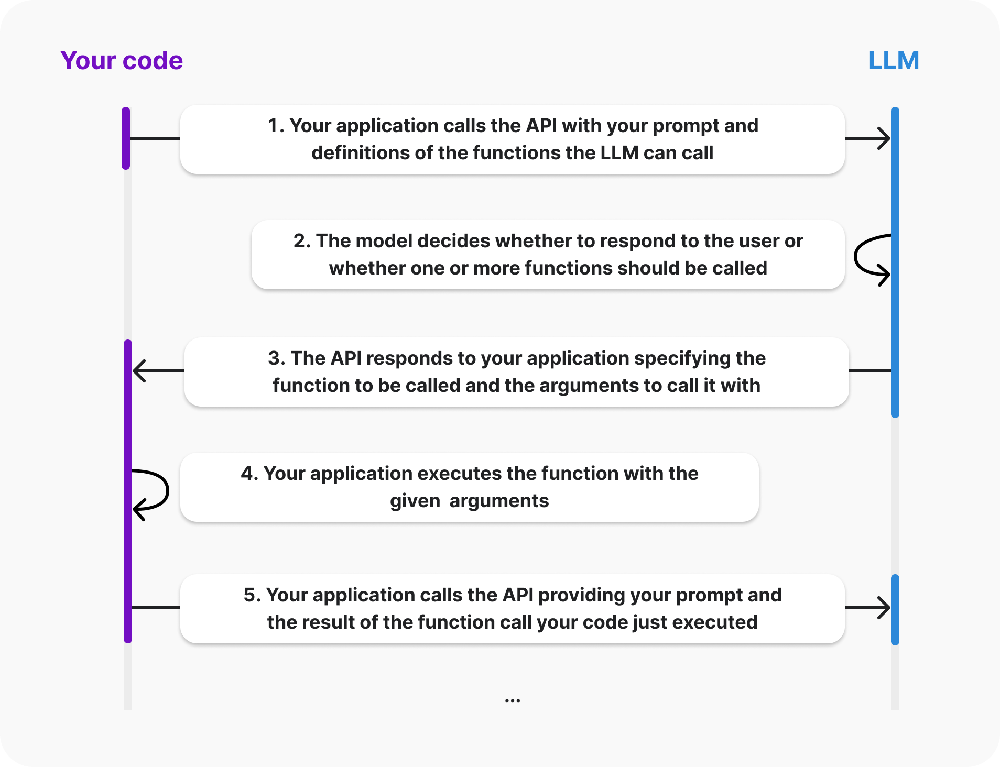

## OpenAI's function calling

Docs: https://platform.openai.com/docs/guides/function-calling

### Run 
  Use JDK version: 11

  Install and use Scala plugin:
  https://www.jetbrains.com/help/idea/get-started-with-scala.html

  or CLI (macOS or Linux)
  
  Install Homebrew
  ```
  /bin/bash -c "$(curl -fsSL https://raw.githubusercontent.com/Homebrew/install/HEAD/install.sh)"
  ``` 
  Install sbt
  ```  
  brew install sbt
  ```
  Run
  ```
  sbt run
  ```
  The lifecycle of a function call
  


